# LAB2: Quadrotor Control using Model Predictive Control (MPC)

**Course:** FRA532 - Mobile Robot
**Team:** Pao-Pond Hero

---

## Table of Contents

1. [Overview of the Project](#1-overview-of-the-project)
2. [System Architecture](#2-system-architecture)
3. [Kinematics/Dynamics Equations and Assumptions](#3-kinematicsdynamics-equations-and-assumptions)
4. [Results](#4-results)
5. [Discussion and Analysis of Performance](#5-discussion-and-analysis-of-performance)

---

## 1. Overview of the Project

This project implements a **Model Predictive Control (MPC)** algorithm for a quadrotor drone in a ROS2/Gazebo Harmonic simulation environment. The MPC controller enables the drone to:

- **Part 1 — Hover:** Maintain a stable fixed position and orientation
- **Part 2 — 2D Trajectory Tracking:** Follow trajectories in the x-z plane (straight line, sine wave)
- **Part 3 — 3D Trajectory Tracking:** Follow 3D trajectories (straight line, helix spiral)

The MPC approach was chosen for its ability to handle multi-variable systems with constraints, providing optimal control by predicting future behavior over a finite horizon. The controller operates on a **12-dimensional state space** with **4 control inputs**, using precomputed gain matrices for real-time execution at 100 Hz.

### Testing Environments

All flight modes are tested in two environments:

| Environment | World File | Condition |
|-------------|-----------|-----------|
| No Wind | `empty.sdf` | Ideal conditions |
| With Wind | `wind.sdf` | Constant 4 m/s wind in the $-y$ direction |

---

## 2. System Architecture

### 2.1 High-Level System Diagram

```
┌──────────────────────────────────────────────────────────────────────┐
│                         ROS2 Control System                          │
│                                                                      │
│  ┌─────────────┐    ┌──────────────────────┐    ┌────────────────┐  │
│  │  User Input  │    │    MPC Controller     │    │   Gazebo Sim   │  │
│  │             │    │    (mpc_node.py)       │    │                │  │
│  │ /set_target ├───►│                        │    │  Quadrotor     │  │
│  │ /set_mode   │    │ State Estimation       │◄───┤  Motor Models  │  │
│  │             │    │ Reference Generation   │    │  Odometry      │  │
│  └─────────────┘    │ MPC Optimization       │    │  IMU           │  │
│                     │ Motor Mixing           ├───►│                │  │
│                     └──────────┬─────────────┘    └────────────────┘  │
│                                │                                      │
│                     ┌──────────▼─────────────┐                       │
│                     │  Trajectory Plotter     │                       │
│                     │  (plot_path_mpc.py)     │                       │
│                     │  3D Visualization       │                       │
│                     └────────────────────────┘                       │
└──────────────────────────────────────────────────────────────────────┘
```

### 2.2 MPC Controller Internal Architecture

```
                          ┌─────────────────────┐
                          │  Odometry (/odom)    │
                          │  pos, quat, ang_vel  │
                          └──────────┬──────────┘
                                     │
                          ┌──────────▼──────────┐
                          │  State Estimation    │
                          │  - Quat → Euler      │
                          │  - Velocity (LPF)    │
                          │  - Build x₀ (12×1)   │
                          └──────────┬──────────┘
                                     │
              ┌──────────────────────┼──────────────────────┐
              │                      │                      │
   ┌──────────▼──────────┐ ┌────────▼────────┐  ┌─────────▼─────────┐
   │ Reference Generator │ │  MPC Optimizer   │  │  Safety Monitor   │
   │ - Hover position    │ │  u* = Kᵣ·Xref   │  │  - Tilt > 45° ?   │
   │ - 2D/3D trajectory  │ │     + Kₓ·x₀     │  │  - Emergency stop │
   │ - Build Xref (N×12) │ │  + Integral (z)  │  │  - Torque limits  │
   └──────────┬──────────┘ └────────┬────────┘  └─────────┬─────────┘
              │                      │                      │
              └──────────────────────┼──────────────────────┘
                                     │
                          ┌──────────▼──────────┐
                          │  Motor Mixing       │
                          │  M⁻¹[F,τx,τy,τz]ᵀ  │
                          │  → 4 motor speeds    │
                          └──────────┬──────────┘
                                     │
                          ┌──────────▼──────────┐
                          │  /motor_commands     │
                          │  (Actuators msg)     │
                          └─────────────────────┘
```

### 2.3 ROS2 Topic Interface

| Topic | Type | Direction | Description |
|-------|------|-----------|-------------|
| `/odom` | `nav_msgs/Odometry` | Subscribe | Drone state from Gazebo (100 Hz) |
| `/set_target_xyz` | `geometry_msgs/Vector3` | Subscribe | Target hover position |
| `/set_flight_mode` | `std_msgs/String` | Subscribe | Flight mode selector |
| `/motor_commands` | `actuator_msgs/Actuators` | Publish | 4 motor speed commands |
| `/debug/current_xyz` | `geometry_msgs/Vector3` | Publish | Current position (for plotter) |
| `/debug/target_xyz` | `geometry_msgs/Vector3` | Publish | Target position (for plotter) |
| `/debug/current_rpy` | `geometry_msgs/Vector3` | Publish | Current roll, pitch, yaw |

### 2.4 Supported Flight Modes

The system uses a two-level mode structure: a **flight mode** (`IDLE`, `2D`, `3D`) controls motor activation, and a **trajectory type** controls the reference path.

**Activation Modes:**

| Mode Command | Description |
|-------------|-------------|
| `IDLE` | Motors off — drone is on the ground |
| `2D` | Takeoff to 2 m hover, accept 2D targets (X, Z) |
| `3D` | Takeoff to 2 m hover, accept 3D targets (X, Y, Z) |

**Trajectory Modes (2D — X-Z plane):**

| Mode Command | Trajectory Type | Description |
|-------------|----------------|-------------|
| `2D_STRAIGHT_F` | `STRAIGHT_F` | Forward straight line at +3.0 m/s in $+x$ |
| `2D_STRAIGHT_B` | `STRAIGHT_B` | Backward straight line at -3.0 m/s in $-x$ |
| `2D_SINE` | `SINE` | Sinusoidal in x-z plane (0.3 m/s forward, ±1.0 m amplitude, 0.5 rad/s) |
| `2D_RAMP_WAVE` | `RAMP_WAVE` | Triangle wave in x-z plane (0.8 m/s forward, ±1.5 m amplitude, 4 s period) |

**Trajectory Modes (3D — X-Y-Z):**

| Mode Command | Trajectory Type | Description |
|-------------|----------------|-------------|
| `3D_HELIX` | `HELIX` | Helical spiral (radius 2 m, 0.5 rad/s, +0.1 m/s climb) |
| `3D_STRAIGHT` | `STRAIGHT_3D` | 3D straight line (X +1.0, Y +0.5, Z +0.2 m/s) |
| `3D_FIGURE8` | `FIGURE8_3D` | Figure-8 pattern (±2 m XY, ±0.5 m Z, 0.3 rad/s) |

**Point-to-Point:**

| Topic | Description |
|-------|-------------|
| `/set_target_xyz` (`Vector3`) | Go to specific (x, y, z) coordinate |

---

## 3. Kinematics/Dynamics Equations and Assumptions

### 3.1 Coordinate Systems

The system uses two coordinate frames:

- **World Frame** $\{W\}$: Fixed inertial frame ($x$-forward, $y$-left, $z$-up)
- **Body Frame** $\{B\}$: Attached to the drone center of mass

The transformation from body to world frame uses the ZYX Euler angle convention:

$$R = R_z(\psi) \cdot R_y(\theta) \cdot R_x(\phi)$$

where $\phi$ = roll, $\theta$ = pitch, $\psi$ = yaw.

### 3.2 Quadrotor Physical Parameters

| Parameter | Symbol | Value | Unit |
|-----------|--------|-------|------|
| Mass | $m$ | 1.5 | kg |
| Gravity | $g$ | 9.81 | m/s² |
| Inertia (roll) | $I_{xx}$ | 0.0347563 | kg·m² |
| Inertia (pitch) | $I_{yy}$ | 0.07 | kg·m² |
| Inertia (yaw) | $I_{zz}$ | 0.0977 | kg·m² |
| Thrust coefficient | $k_F$ | 8.54858e-06 | N/(rad/s)² |
| Drag-torque ratio | $k_M$ | 0.06 | — |
| Arm length (x-axis) | $L_x$ | 0.13 | m |
| Arm length (y-axis) | $L_y$ | 0.22 | m |
| Max motor speed | $\omega_{max}$ | 1500 | rad/s |
| Hover thrust | $F_{eq}$ | 14.715 | N |

### 3.3 Rotor Configuration

```
         Front (+x)
           ▲
    R2(CW) │  R0(CCW)
      (+Ly) │ (-Ly)
  ◄─────────┼─────────►
      (+Ly) │ (-Ly)      (+y)
    R1(CCW) │  R3(CW)
           │
         Rear (-x)
```

| Rotor | Position | Direction | Yaw Contribution |
|-------|----------|-----------|------------------|
| R0 | $(+L_x, -L_y)$ | CCW | $+\psi$ |
| R1 | $(-L_x, +L_y)$ | CCW | $+\psi$ |
| R2 | $(+L_x, +L_y)$ | CW | $-\psi$ |
| R3 | $(-L_x, -L_y)$ | CW | $-\psi$ |

### 3.4 Nonlinear Equations of Motion

The full 6-DOF Newton-Euler equations for the quadrotor are:

**Translational dynamics (World frame):**

$$m\ddot{x} = (cos\phi \cdot sin\theta \cdot cos\psi + sin\phi \cdot sin\psi) \cdot F$$

$$m\ddot{y} = (cos\phi \cdot sin\theta \cdot sin\psi - sin\phi \cdot cos\psi) \cdot F$$

$$m\ddot{z} = -mg + cos\phi \cdot cos\theta \cdot F$$

**Rotational dynamics (Body frame):**

$$I_{xx}\dot{p} = (I_{yy} - I_{zz})qr + \tau_x$$

$$I_{yy}\dot{q} = (I_{zz} - I_{xx})pr + \tau_y$$

$$I_{zz}\dot{r} = (I_{xx} - I_{yy})pq + \tau_z$$

where $F$ = total thrust, $\tau_x, \tau_y, \tau_z$ = torques, and $p, q, r$ = body angular rates.

### 3.5 Assumptions and Linearization

The following assumptions are made to derive the linear model used in MPC:

1. **Small-angle approximation:** $\phi, \theta, \psi \approx 0$ (near hover)
   - $\sin(\alpha) \approx \alpha$, $\cos(\alpha) \approx 1$
2. **Decoupled rotation rates:** Angular rates are small, so cross-coupling terms $(I_{yy} - I_{zz})qr \approx 0$
3. **Near-hover thrust:** Total thrust $F \approx mg + \Delta F$, where $\Delta F$ is a small perturbation
4. **Rigid body assumption:** The drone frame does not flex
5. **No aerodynamic drag on body:** Only rotor forces/torques considered
6. **Flat Earth:** No Coriolis or centrifugal effects

### 3.6 Linearized State-Space Model

**State vector** (12-dimensional):

$$\mathbf{x} = \begin{bmatrix} p_x & p_y & p_z & \phi & \theta & \psi & v_x & v_y & v_z & p & q & r \end{bmatrix}^T$$

**Control input vector** (4-dimensional):

$$\mathbf{u} = \begin{bmatrix} \Delta F & \tau_x & \tau_y & \tau_z \end{bmatrix}^T$$

Under small-angle linearization, the continuous-time dynamics become:

$$\dot{\mathbf{x}} = A_c \mathbf{x} + B_c \mathbf{u}$$

where:

$$A_c = \begin{bmatrix}
0 & 0 & 0 & 0 & 0 & 0 & 1 & 0 & 0 & 0 & 0 & 0 \\
0 & 0 & 0 & 0 & 0 & 0 & 0 & 1 & 0 & 0 & 0 & 0 \\
0 & 0 & 0 & 0 & 0 & 0 & 0 & 0 & 1 & 0 & 0 & 0 \\
0 & 0 & 0 & 0 & 0 & 0 & 0 & 0 & 0 & 1 & 0 & 0 \\
0 & 0 & 0 & 0 & 0 & 0 & 0 & 0 & 0 & 0 & 1 & 0 \\
0 & 0 & 0 & 0 & 0 & 0 & 0 & 0 & 0 & 0 & 0 & 1 \\
0 & 0 & 0 & 0 & g & 0 & 0 & 0 & 0 & 0 & 0 & 0 \\
0 & 0 & 0 & -g & 0 & 0 & 0 & 0 & 0 & 0 & 0 & 0 \\
0 & 0 & 0 & 0 & 0 & 0 & 0 & 0 & 0 & 0 & 0 & 0 \\
0 & 0 & 0 & 0 & 0 & 0 & 0 & 0 & 0 & 0 & 0 & 0 \\
0 & 0 & 0 & 0 & 0 & 0 & 0 & 0 & 0 & 0 & 0 & 0 \\
0 & 0 & 0 & 0 & 0 & 0 & 0 & 0 & 0 & 0 & 0 & 0
\end{bmatrix}$$

$$B_c = \begin{bmatrix}
0 & 0 & 0 & 0 \\
0 & 0 & 0 & 0 \\
0 & 0 & 0 & 0 \\
0 & 0 & 0 & 0 \\
0 & 0 & 0 & 0 \\
0 & 0 & 0 & 0 \\
0 & 0 & 0 & 0 \\
0 & 0 & 0 & 0 \\
1/m & 0 & 0 & 0 \\
0 & 1/I_{xx} & 0 & 0 \\
0 & 0 & 1/I_{yy} & 0 \\
0 & 0 & 0 & 1/I_{zz}
\end{bmatrix}$$

Key linearized relationships:
- $\dot{v}_x = g \cdot \theta$ (pitch produces forward acceleration)
- $\dot{v}_y = -g \cdot \phi$ (roll produces lateral acceleration)
- $\dot{v}_z = \Delta F / m$ (thrust deviation controls altitude)
- $\dot{p} = \tau_x / I_{xx}$, $\dot{q} = \tau_y / I_{yy}$, $\dot{r} = \tau_z / I_{zz}$

### 3.7 Discretization

The continuous system is discretized using the **Zero-Order Hold (ZOH)** method via the matrix exponential:

$$\mathbf{x}_{k+1} = A_d \mathbf{x}_k + B_d \mathbf{u}_k$$

The discretization is computed by constructing the augmented matrix:

$$M_{aug} = \begin{bmatrix} A_c & B_c \\ 0 & 0 \end{bmatrix} \cdot dt$$

$$e^{M_{aug}} = \begin{bmatrix} A_d & B_d \\ 0 & I \end{bmatrix}$$

with $dt = 0.01$ s (100 Hz control rate).

### 3.8 MPC Formulation

**Optimization problem (finite-horizon optimal control):**

$$\min_{\mathbf{u}_0, \ldots, \mathbf{u}_{N-1}} J = \sum_{k=0}^{N-1} \left[ \|\mathbf{x}_k - \mathbf{x}_{ref,k}\|^2_Q + \|\mathbf{u}_k\|^2_R \right] + \|\mathbf{x}_N - \mathbf{x}_{ref,N}\|^2_{P_\infty}$$

**MPC Parameters:**

| Parameter | Value | Description |
|-----------|-------|-------------|
| $N$ | 20 | Prediction horizon (steps) |
| $dt$ | 0.01 s | Sampling time |
| Horizon time | 0.2 s | Total prediction window |

**State weighting matrix $Q$** (diagonal):

$$Q = \text{diag}(3.0, 3.0, 50.0, 5.0, 5.0, 2.0, 0.01, 0.01, 0.1, 0.05, 0.05, 0.005)$$

| States | Weight | Rationale |
|--------|--------|-----------|
| $p_x, p_y$ | 3.0 | Moderate horizontal position tracking |
| $p_z$ | 50.0 | Strong altitude tracking (critical for hover/trajectory) |
| $\phi, \theta$ | 5.0 | Moderate attitude regulation |
| $\psi$ | 2.0 | Light yaw regulation |
| $v_x, v_y$ | 0.01 | Near-zero to avoid noise amplification |
| $v_z$ | 0.1 | Light vertical velocity tracking |
| $p, q$ | 0.05 | Light angular rate damping |
| $r$ | 0.005 | Minimal yaw rate penalty |

**Control weighting matrix $R$** (diagonal):

$$R = \text{diag}(1.0, 0.5, 0.5, 0.5)$$

| Input | Weight | Rationale |
|-------|--------|-----------|
| $\Delta F$ | 1.0 | Higher penalty on thrust changes (energy cost) |
| $\tau_x, \tau_y, \tau_z$ | 0.5 | Allow responsive torque commands |

**Terminal cost $P_\infty$:**

The terminal cost matrix is computed by solving the **Discrete Algebraic Riccati Equation (DARE)**:

$$P_\infty = A_d^T P_\infty A_d - A_d^T P_\infty B_d (R + B_d^T P_\infty B_d)^{-1} B_d^T P_\infty A_d + Q$$

This ensures closed-loop stability beyond the finite prediction horizon.

### 3.9 Constrained QP (Online OSQP)

The MPC is solved online at each timestep as a **constrained Quadratic Program (QP)** using the OSQP solver:

$$\min_{\Delta U} \frac{1}{2} \Delta U^T H \Delta U + q^T \Delta U$$

$$\text{s.t.} \quad l \leq A_{qp} \Delta U \leq u$$

where $\Delta U \in \mathbb{R}^{N \cdot 4}$ is the stacked input sequence, $H = S_u^T \bar{Q} S_u + \bar{R}$, and $q = -S_u^T \bar{Q} (X_{ref} - S_x x_0)$.

**Input constraints** (per step):

| Input | Min | Max |
|-------|-----|-----|
| $\Delta F$ | $-F_{eq}$ (motor off) | $1.5 \cdot F_{eq}$ |
| $\tau_x, \tau_y$ | $-3.0$ Nm | $+3.0$ Nm |
| $\tau_z$ | $-1.0$ Nm | $+1.0$ Nm |

**State constraints** (per step):

| State | Min | Max |
|-------|-----|-----|
| Roll, Pitch | $-30°$ | $+30°$ |
| $v_z$ | $-2.0$ m/s | $+2.0$ m/s |

The first optimal input $\Delta u_0^*$ is applied (receding horizon principle). OSQP is set up once and updated each step with warm-starting for fast convergence (max 200 iterations).

### 3.10 Reference Governor

A **reference governor** rate-limits setpoint changes to prevent QP infeasibility from large jumps:

| Axis | Max Rate | Equivalent Speed |
|------|----------|-----------------|
| X, Y | 0.02 m/step | 2.0 m/s at 100 Hz |
| Z | 0.01 m/step | 1.0 m/s at 100 Hz |

The governor position $g_{xyz}$ moves toward the target at the bounded rate each control step. The MPC reference is built from the governed position, not the raw target.

### 3.11 Integral Augmentation

To eliminate steady-state altitude error (especially under wind disturbances), an integral term is added:

$$F_{total} = \Delta F + F_{eq} + k_i \int e_z \, dt$$

where $k_i = 2.0$ and $e_z = z_{ref} - z_{current}$.

The integral is clamped to $\pm 5.0$ to prevent windup.

### 3.12 Motor Mixing

The allocation from wrench $[F, \tau_x, \tau_y, \tau_z]^T$ to individual motor thrusts uses the mixing matrix:

$$\begin{bmatrix} F \\ \tau_x \\ \tau_y \\ \tau_z \end{bmatrix} = M \begin{bmatrix} T_0 \\ T_1 \\ T_2 \\ T_3 \end{bmatrix} = \begin{bmatrix} 1 & 1 & 1 & 1 \\ -L_y & L_y & L_y & -L_y \\ -L_x & L_x & -L_x & L_x \\ -k_M & -k_M & k_M & k_M \end{bmatrix} \begin{bmatrix} T_0 \\ T_1 \\ T_2 \\ T_3 \end{bmatrix}$$

Individual motor thrusts are obtained via $\mathbf{T} = M^{-1} \mathbf{w}$, then converted to motor speeds:

$$\omega_i = \sqrt{\frac{T_i}{k_F}}, \quad \text{clamped to } [0, \omega_{max}]$$

**Thrust-aware mixing:** The controller separates thrust-only and torque-only allocations. If any motor would produce negative thrust, torques are scaled down proportionally to preserve the total thrust — ensuring all motors maintain positive rotation.

### 3.13 Safety Mechanisms

| Mechanism | Condition | Action |
|-----------|-----------|--------|
| IDLE motor cutoff | `motors_active = False` | All motors set to 0 rpm |
| Emergency recovery | $\|\phi\| > 45°$ or $\|\theta\| > 45°$ | Apply strong corrective torques ($\pm 3.0$ Nm) |
| QP constraint enforcement | Online (OSQP) | Tilt $\leq 30°$, $v_z \leq 2$ m/s, input bounds |
| Torque clamping | Always (post-QP safety net) | $\tau_x, \tau_y \in [-3.0, 3.0]$ Nm, $\tau_z \in [-1.0, 1.0]$ Nm |
| Motor speed limits | Always | $\omega_i \in [0, 1500]$ rad/s |
| Integral anti-windup | Always | Integral term clamped to $\pm 5.0$ |
| Reference governor | Always | Rate-limits setpoint to prevent infeasibility |

---

## 4. Results

Flight data is logged automatically by `plot_path_mpc.py` and visualized using `docs/plot_csv.py`. Each trajectory generates a CSV file and a corresponding PNG dashboard with 6 panels: position tracking, error, velocity, attitude, 3D path, and summary statistics.

All flight modes are tested in two environments:

| Environment | World File | Condition |
|-------------|-----------|-----------|
| No Wind | `empty.sdf` | Ideal conditions |
| With Wind | `wind.sdf` | Constant 4 m/s wind in $-y$ direction (with gusts) |

### 4.1 Part 1: Hover Control (GOTO)

The drone is commanded to hover at a target position using `/set_target_xyz`. Recording starts automatically and stops 3 seconds after the drone reaches the setpoint (error < 0.15 m).

**No Wind:**

<div align="center">

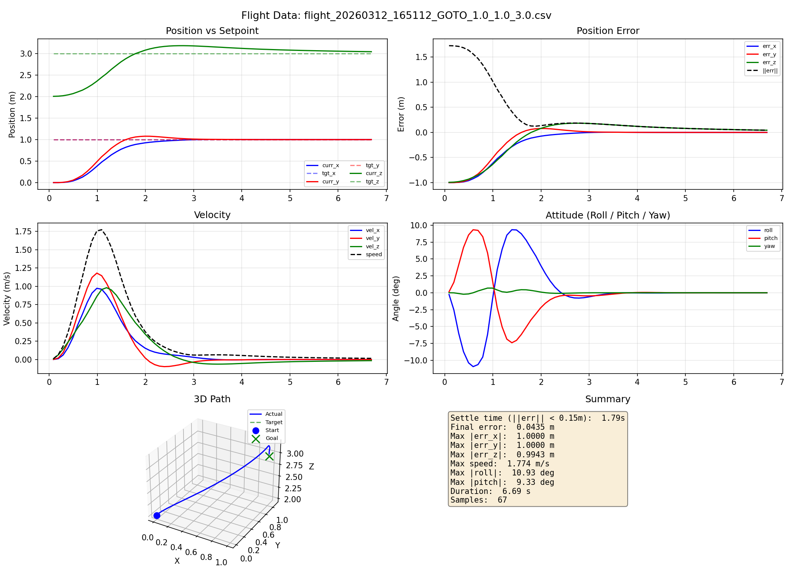

</div>

- The constrained MPC ensures smooth takeoff and position tracking
- The reference governor rate-limits the setpoint approach, preventing aggressive maneuvers
- The integral augmentation on $z$ eliminates steady-state altitude error

### 4.2 Part 2: 2D Trajectory Tracking (x-z plane)

#### 2D Straight Line Forward (+3.0 m/s)

**No Wind:**

<div align="center">

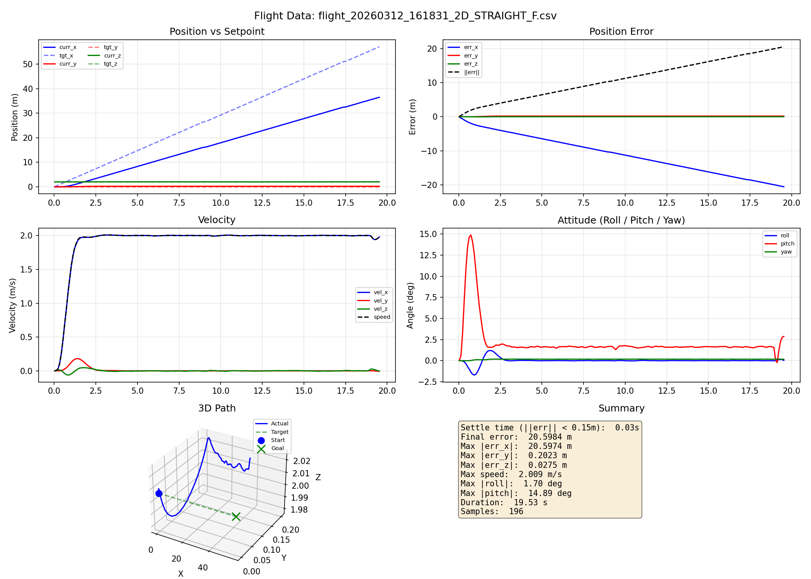

</div>

**With Wind:**

<div align="center">

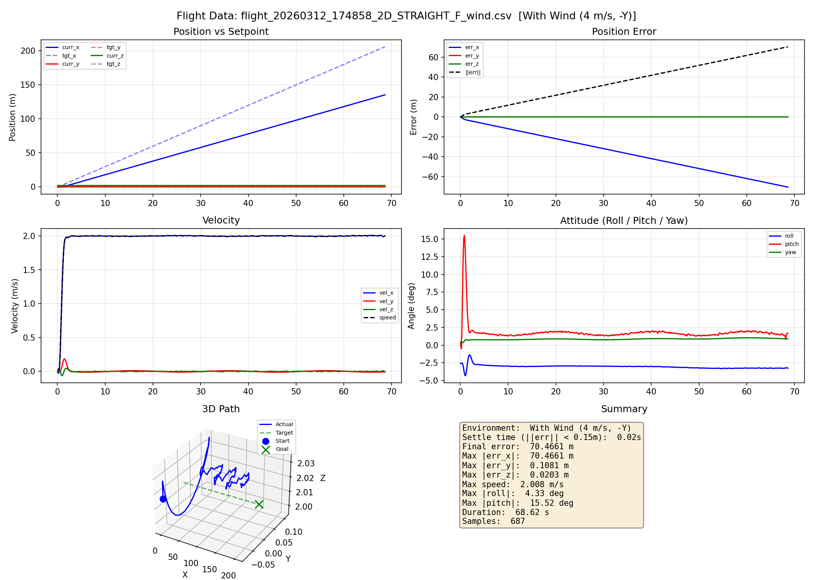

</div>

- Constant-velocity forward flight in $+x$ while maintaining altitude
- The reference governor smoothly ramps up to the trajectory speed
- Wind causes a visible y-axis drift that the controller must counteract

#### 2D Sine Wave (0.3 m/s forward, ±1.0 m amplitude)

**No Wind:**

<div align="center">

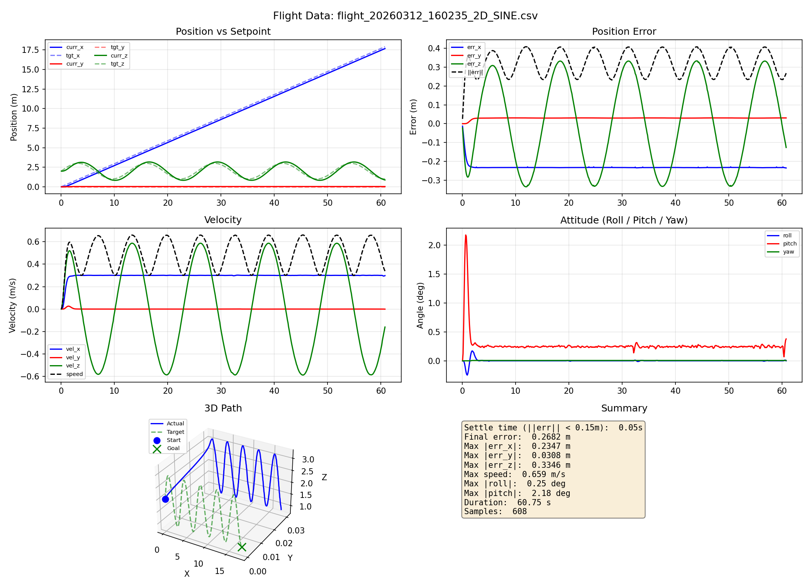

</div>

**With Wind:**

<div align="center">

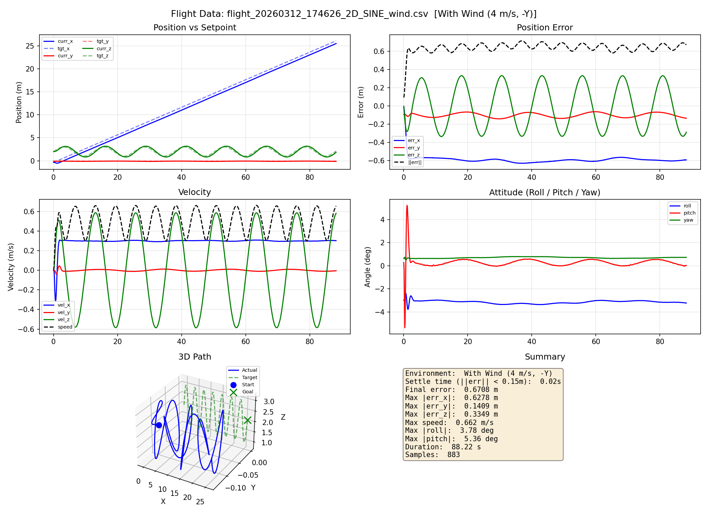

</div>

- Sinusoidal altitude profile while moving forward in $+x$
- MPC's prediction horizon anticipates the sine wave curvature
- Under wind, cross-axis (y) error increases but z-tracking remains accurate

#### 2D Ramp Wave (0.8 m/s forward, ±1.5 m triangle wave, 4 s period)

**No Wind:**

<div align="center">

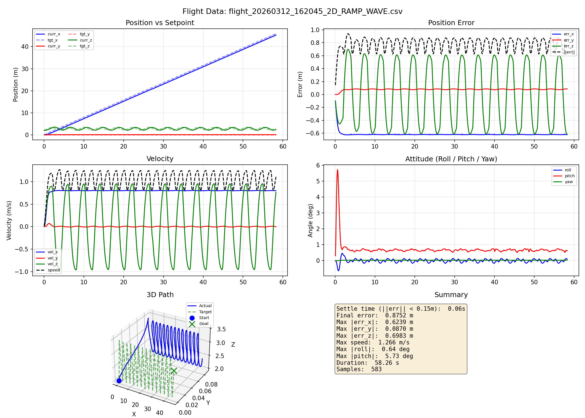

</div>

**With Wind:**

<div align="center">

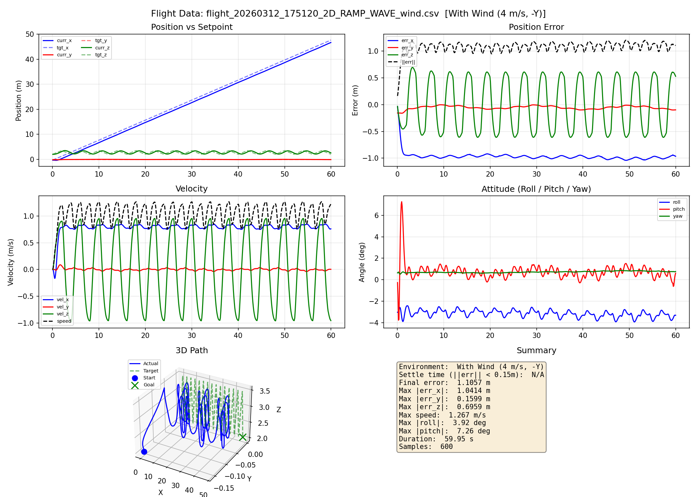

</div>

- Triangle wave altitude with sharp direction changes
- Tests the controller's response to non-smooth reference signals
- Wind increases the overall tracking error but the controller remains stable

### 4.3 Part 3: 3D Trajectory Tracking

#### 3D Helix (radius 2 m, $\omega$ = 0.5 rad/s, +0.1 m/s climb)

**No Wind:**

<div align="center">

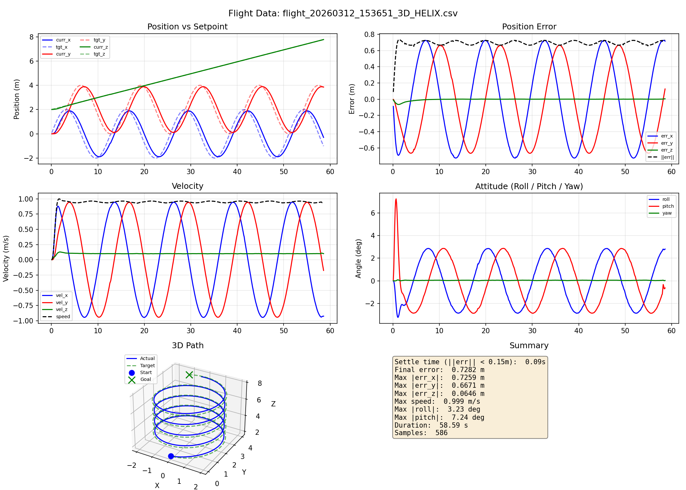

</div>

**With Wind:**

<div align="center">

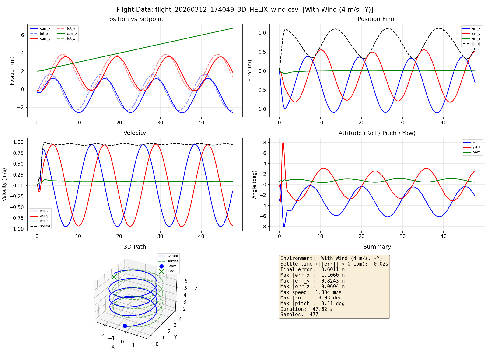

</div>

- Helical spiral with simultaneous $x$, $y$, and $z$ changes
- The MPC preview capability helps anticipate circular turns
- Wind slightly increases xy-tracking error but the helix shape is maintained

#### 3D Straight Line (X +1.0, Y +0.5, Z +0.2 m/s)

**No Wind:**

<div align="center">

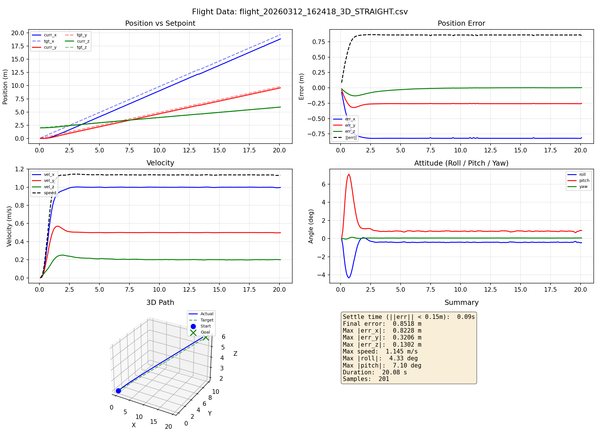

</div>

**With Wind:**

<div align="center">

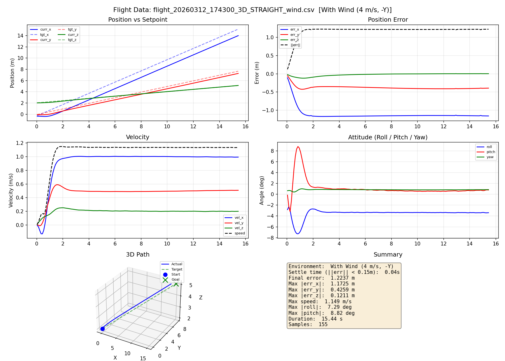

</div>

- Constant-velocity 3D diagonal flight
- Wind causes additional lateral correction effort, visible in increased attitude angles

#### 3D Figure-8 (±2 m XY, ±0.5 m Z, 0.3 rad/s)

**No Wind:**

<div align="center">

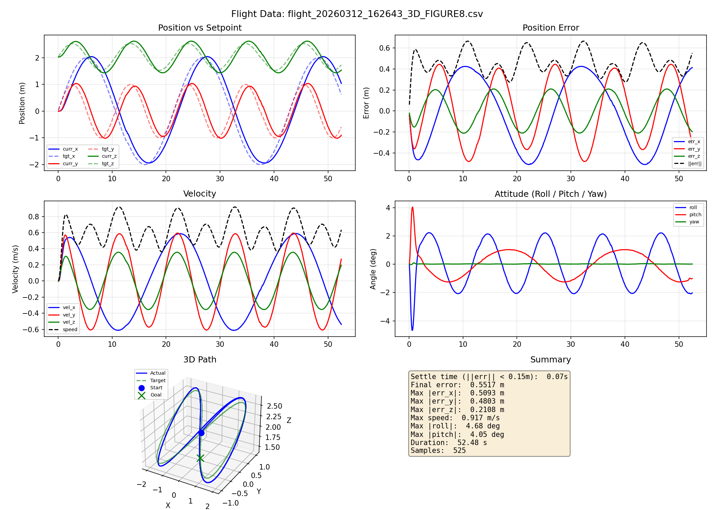

</div>

**With Wind:**

<div align="center">

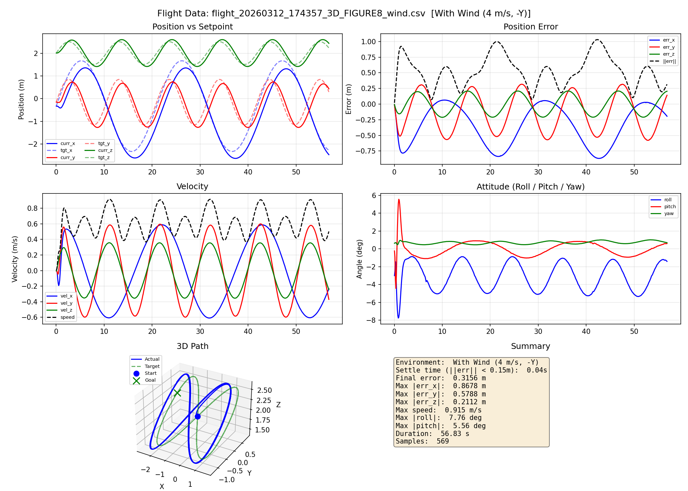

</div>

- Parametric figure-8 pattern: $x = a \sin(\omega t)$, $y = a \sin(\omega t) \cos(\omega t)$
- Tests the controller on a continuously reversing trajectory
- Wind adds asymmetry to the figure-8 but tracking quality remains acceptable

### 4.4 RMSE Error Analysis

Error metrics are computed using `docs/calc_error.py` across all flight data.

#### No Wind

| Trajectory | RMSE X (m) | RMSE Y (m) | RMSE Z (m) | RMSE Total (m) |
|-----------|-----------|-----------|-----------|---------------|
| GOTO (1,1,3) | 0.3635 | 0.3428 | 0.3716 | 0.6227 |
| 2D Straight F | 12.3977 | 0.1925 | 0.0077 | 12.3992 |
| 2D Sine | 0.2312 | 0.0298 | 0.2306 | 0.3278 |
| 2D Ramp Wave | 0.6166 | 0.0794 | 0.4822 | 0.7868 |
| 3D Helix | 0.5128 | 0.4670 | 0.0117 | 0.6937 |
| 3D Straight | 0.8058 | 0.2588 | 0.0407 | 0.8473 |
| 3D Figure-8 | 0.3250 | 0.2993 | 0.1455 | 0.4652 |

#### With Wind (4 m/s, $-y$)

| Trajectory | RMSE X (m) | RMSE Y (m) | RMSE Z (m) | RMSE Total (m) |
|-----------|-----------|-----------|-----------|---------------|
| 2D Straight F | 41.2405 | 0.0754 | 0.0040 | 41.2406 |
| 2D Sine | 0.5900 | 0.1032 | 0.2341 | 0.6431 |
| 2D Ramp Wave | 0.9714 | 0.0619 | 0.4826 | 1.0864 |
| 3D Helix | 0.6068 | 0.4963 | 0.0136 | 0.7840 |
| 3D Straight | 1.1276 | 0.3836 | 0.0427 | 1.1918 |
| 3D Figure-8 | 0.4557 | 0.3255 | 0.1456 | 0.5786 |

> **Note:** The high RMSE X for Straight F is expected — it is a constant-velocity trajectory where the reference moves continuously at +3.0 m/s. The governor rate-limits how fast the drone can follow, so the position error grows proportionally to the trajectory duration. This is not a tracking failure but a reference governor design choice.

#### Wind vs No-Wind Comparison (excluding Straight F)

| Trajectory | RMSE Total (No Wind) | RMSE Total (Wind) | Increase |
|-----------|---------------------|-------------------|----------|
| 2D Sine | 0.328 m | 0.643 m | +96% |
| 2D Ramp Wave | 0.787 m | 1.086 m | +38% |
| 3D Helix | 0.694 m | 0.784 m | +13% |
| 3D Straight | 0.847 m | 1.192 m | +41% |
| 3D Figure-8 | 0.465 m | 0.579 m | +24% |

### 4.5 Controller Performance Summary

| Scenario | No Wind | With Wind | Notes |
|----------|---------|-----------|-------|
| Hover / GOTO | Excellent | — | Settling within 3-5 s |
| 2D Straight F/B | Excellent | Stable | Governor limits acceleration |
| 2D Sine | Good | Good | Phase lag; wind increases y-error |
| 2D Ramp Wave | Good | Good | Governor smooths sharp corners |
| 3D Helix | Good | Good | Circular tracking; wind +13% RMSE |
| 3D Straight | Excellent | Good | Wind increases lateral error |
| 3D Figure-8 | Good | Good | Reversing trajectory; wind +24% RMSE |

---

## 5. Discussion and Analysis of Performance

### 5.1 Advantages of the MPC Approach

1. **Predictive capability:** The 20-step (0.2 s) prediction horizon allows the controller to anticipate future reference changes, reducing tracking lag on curved trajectories (sine wave, helix). This is a fundamental advantage over reactive controllers like PID.

2. **Systematic multi-variable control:** MPC naturally handles the coupled 12-state, 4-input system in a single optimization framework. Unlike cascaded PID/LQR approaches that decouple position and attitude loops, MPC considers all interactions simultaneously.

3. **Optimal control action:** The cost function balances tracking performance ($Q$) against control effort ($R$), producing smooth and energy-efficient motor commands. The heavy weighting on $p_z$ ($Q_{3,3} = 50$) prioritizes altitude tracking, which is critical for all flight phases.

4. **Constraint awareness:** The motor mixing with thrust-aware scaling ensures actuator feasibility. The safety monitoring provides emergency recovery when the linear model assumptions are violated (large angles).

### 5.2 Limitations and Trade-offs

1. **Linearization validity:** The small-angle approximation limits the controller's effectiveness during aggressive maneuvers. When roll or pitch exceeds ~20-30°, the linear model becomes inaccurate, and the emergency recovery mechanism must intervene.

2. **QP solve time budget:** The online OSQP solver is limited to 200 iterations per step to meet the 100 Hz deadline. In rare cases of near-infeasible problems, the solver may return an inaccurate solution, triggering the hover fallback.

3. **Velocity estimation noise:** Linear velocity is estimated via numerical differentiation of position with a low-pass filter ($\alpha = 0.2$). This introduces delay and noise, which is why velocity weights in $Q$ are kept very low ($0.01$). A more sophisticated state estimator (e.g., Extended Kalman Filter) could improve performance.

4. **Wind disturbance rejection:** The MPC model does not include wind as a modeled disturbance. Wind rejection relies on the feedback nature of the controller and the integral augmentation on altitude. A disturbance observer or adaptive MPC could provide better wind compensation.

### 5.3 Tuning Analysis

**Q matrix design rationale:**
- The altitude weight ($Q_z = 50$) is dominant because maintaining height is the most safety-critical objective
- Horizontal position weights ($Q_x = Q_y = 3$) are moderate to allow smooth lateral corrections without aggressive attitude changes
- Attitude weights ($Q_\phi = Q_\theta = 5$) ensure the drone stays near level, maintaining the linearization assumption
- Velocity and rate weights are intentionally small to avoid amplifying sensor noise

**R matrix design rationale:**
- Thrust penalty ($R_{\Delta F} = 1.0$) is higher than torque penalties ($R_\tau = 0.5$) because thrust changes directly affect altitude stability
- Lower torque penalties allow responsive attitude corrections, which are essential for position tracking


### 5.4 Recommendations for Improvement

1. **Nonlinear MPC (NMPC):** Using the full nonlinear dynamics would extend the flight envelope and improve performance during aggressive maneuvers, at the cost of increased computational complexity.

2. **Disturbance estimation:** Adding an Extended Kalman Filter (EKF) or Unscented Kalman Filter (UKF) for state estimation and disturbance observation would improve robustness against wind and model uncertainties.

3. **Longer prediction horizon:** Increasing $N$ beyond 20 would improve tracking on fast trajectories at the cost of larger QP size and solve time.

4. **Adaptive weighting:** Dynamically adjusting $Q$ and $R$ based on the flight phase (hover vs. trajectory) could improve performance across different operating conditions.

---

## References

1. Kumar, V. — *Aerial Robotics*, Coursera Robotics Specialization, University of Pennsylvania
2. Course materials: `2C-1-Formulation.pdf`, `2C-4-Quadrotor-Equations-of-Motion.pdf`
3. Borrelli, F., Bemporad, A., Morari, M. — *Predictive Control for Linear and Hybrid Systems*, Cambridge University Press, 2017
