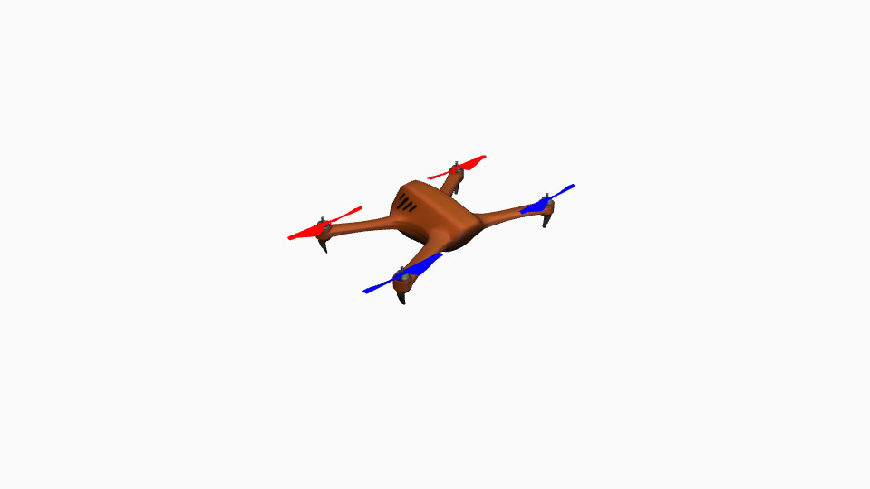
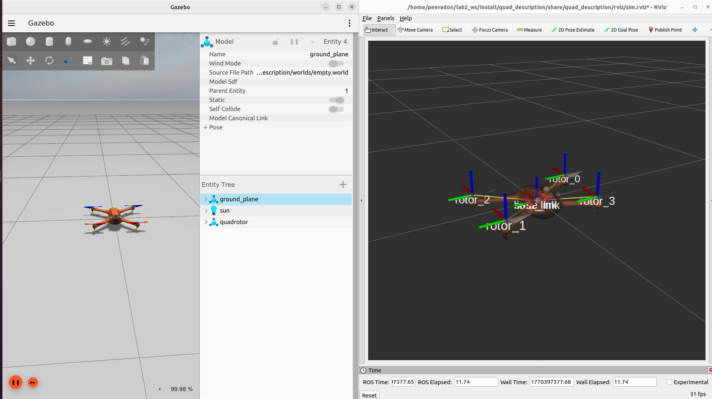

[](https://classroom.github.com/a/Mnj7rZ_g)
# LAB2: Control

> [!NOTE]
> This lab works with groups of 2-3 students.

In this lab, students will apply control methods to make a drone hover and follow a 2D and 3D trajectory.


<p align="center">
  
</p>


## Kinematics and Dynamics of a Quadcopter

You can find the kinematics and dynamics material (both 2D and 3D models) at [material](./material/)

- [Formulation](./material/2C-1-Formulation.pdf) - Coordinate systems, motor model, rotation matrix, forces and moments
- [Quadrotor Equations of Motion](./material/2C-4-Quadrotor-Equations-of-Motion.pdf) - Newton-Euler equations, 2D planar model, 3D full model, state vectors

**References:**
- Coursera Robotics Specialization: Aerial Robotics
- Instructor: Prof. Vijay Kumar, University of Pennsylvania


## Simulation Setup

This lab provides the ROS2 simulation package `quad_description` which contains the drone model and simulation world. Students must use this package for the lab.

### Quick Start

Students must clone this repository and use the `quad_description` package in your ROS2 workspace, then run the simulation:

```bash
ros2 launch quad_description sim.launch.py
```




> [!WARNING]  
> This package uses **Gazebo Harmonic**. If you are using **Gazebo Fortress**, you need to update the plugin names in the URDF files at [gazebo_full.xacro](./quad_description/urdf/gazebo_full.xacro).
> 
> **Example - Joint State Publisher Plugin:**
> - Plugin filename: `gz-sim-joint-state-publisher-system` to `libignition-gazebo6-joint-state-publisher-system.so`
> - Plugin name: `gz::sim::systems::JointStatePublisher` to `ignition::gazebo::systems::JointStatePublisher`


## Testing Environments

For all 3 parts, students must test your controllers in **2 environments**:

1. **Without wind** - [empty.sdf](./quad_description/worlds/empty.sdf)
2. **With wind** - [wind.sdf](./quad_description/worlds/wind.sdf) (4 m/s in `-y` direction)

> [!IMPORTANT]  
> Don't forget to change the world name in [sim.launch.py](./quad_description/launch/sim.launch.py) before running the simulation.


## Part 1: Hover Behavior Control

Apply controllers to make the drone stably hover at a fixed position and orientation using at least `n-1` controllers from the following list, where `n` is the number of students in the group:

- **PID**
- **LQR**
- **Other method**


> [!NOTE]
> For Part 2 and Part 3, the drone must start from hover state (Part 1), fly the trajectory, then return to hover state at the end of trajectory.

## Part 2: 2D Trajectory Behavior Control

Apply controllers from Part 1 to make the drone follow a 2D trajectory in the `x-z` plane. The drone should fly toward the `+x` direction. Implement the following trajectories:

- **Straight Line** 
- **Sine Wave**
- **Other 2D trajectory** (You can choose any additional 2D trajectory)

## Part 3: 3D Trajectory Behavior Control

Extend the controllers from Part 1 to handle a 3D trajectory. Implement the following trajectories:

- **Straight Line** (with changes in all three dimensions)
- **Helix Spiral**
- **Other 3D trajectory** (You can choose any additional 2D trajectory)

## Deliverables

Students should submit:
1. Source code
2. Documentation:
   - Overview of the project
   - System architecture
   - Kinematics/dynamics equations and the assumptions made about the quadrotors/environments
   - Results
   - Discussion and analysis of the performance
